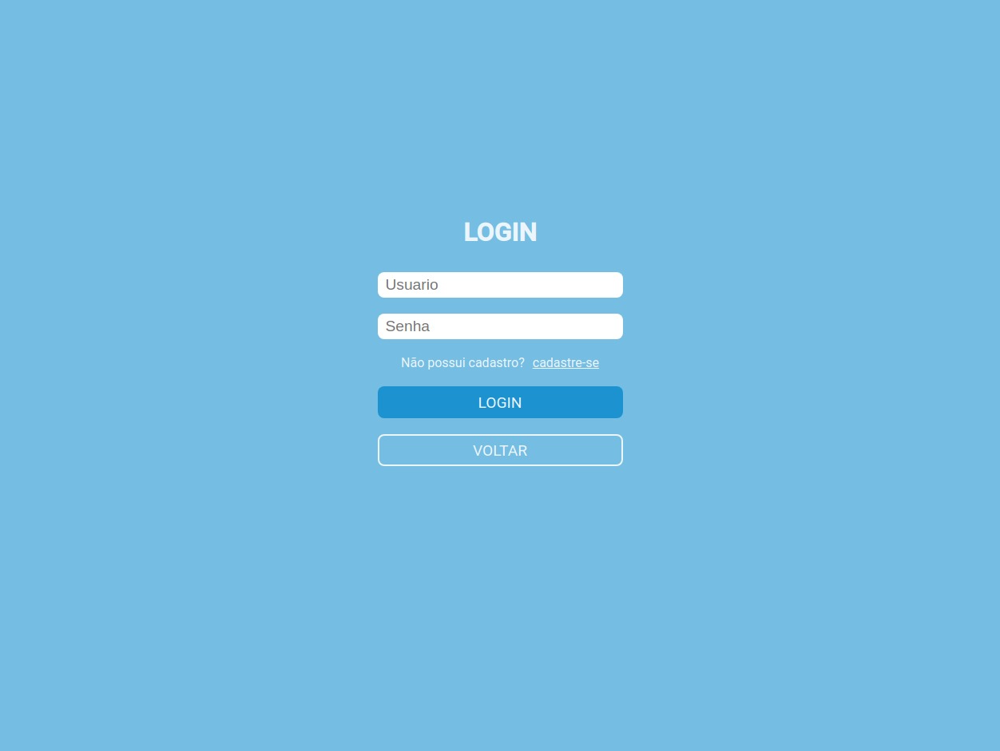
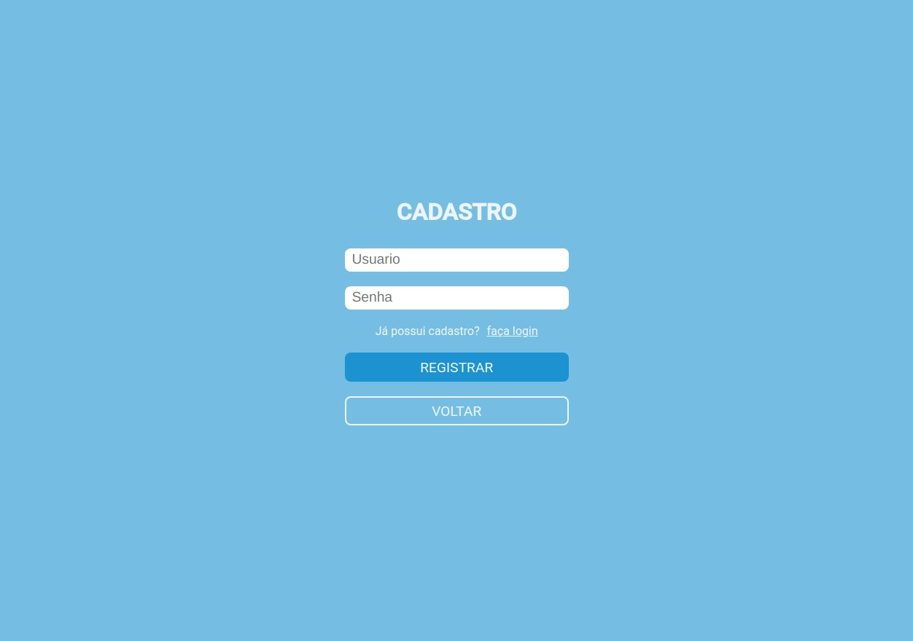
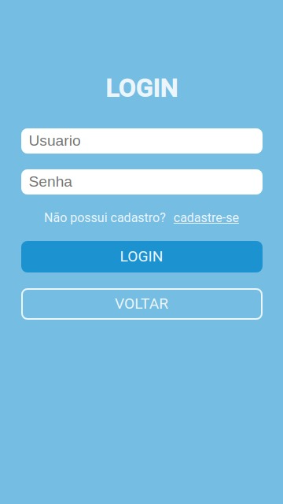
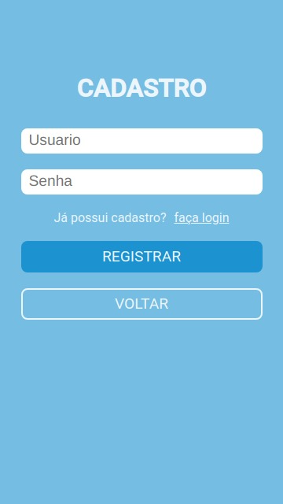
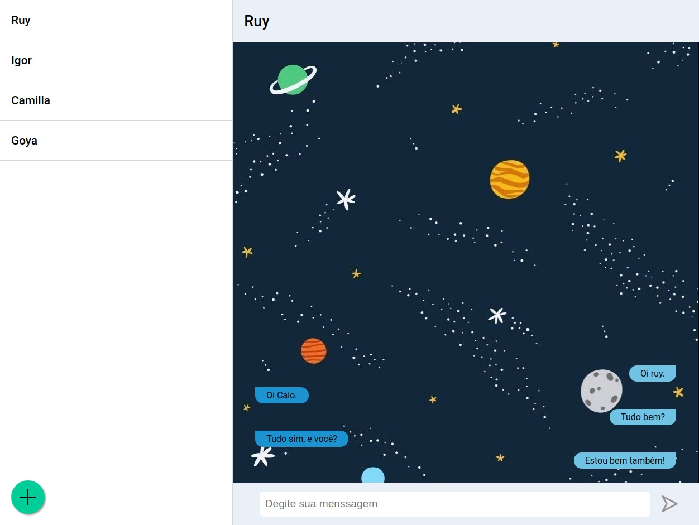

# Projeto Ponere

Com o Ponere chat, suas mensagens são rápidas, simples, seguras e gratuitas. Disponível para web em todo o mundo.

<p align="center">

</p>

## Sobre

Projeto de implementação de um chat para a diciplina Ambiente de desenvolvimento e Operação (DevOps)

Consiste em um chat simples com funcionalidades basicas.

Você pode ver um demostranção do projeto [em breve]().

## Recursos

- [X] Cadastro
- [X] Autenticação
- [X] Chat
- [X] Seleção de Interlocutor

## 🚀 Rodando o projeto

Essas instruções permitirão que você obtenha uma copia do projeto em sua maquina local com proposito de desenvolvimento ou testes.

## 📋 Pre-requisitos

### Front-end

[Node.js versão 14+](https://nodejs.org/pt-br/download/)

### Back-end

[Python versão 3.5+](https://www.python.org/downloads/)


## 🔧 Instalação e Execução

Instruções de como instalar e rodar o projeto em um ambiente local.

Clone o projeto
```
git clone https://github.com/Ruy-Araujo/ponere-chat.git
```

### Front-end

Acesso o diretorio de front-end
```console
cd frontend
```

Instale as dependencias necessarias 
```console
npm install
```

Rode o projeto
```console
npm run dev
```

Após isso o projeto estara rodando no endereço local: http://localhost:3000


### Back-end

Copie o arquivo de dependencias para a pasta backend

windows
```cmd
copy .\requirements.txt .\backend
```
linux
```sh
cp requirements.txt ./backend
```

Acesse o diretorio de back-end
```console
cd backend
```

Instale as dependencias necessarias
```console
pip install -r requirements.txt
```

Rode o projeto
```console
python wsgi.py
```

Após isso o projeto estará rodando no endereço local: http://localhost:5000

## 🛠️ Tecnologias

Front-end
- [React](https://pt-br.reactjs.org/)
- [Next.js](https://nextjs.org/)
- [Material-UI](https://material-ui.com/pt/)
- [DiceBear](https://avatars.dicebear.com/)

Back-end
- [Heroku](https://www.heroku.com/)
- [Flask](https://flask.palletsprojects.com/en/2.0.x/)

## Autores

[](https://github.com/Ruy-Araujo)

_Ruy Araujo_

[](https://www.linkedin.com/in/ruy-araujo/)
[](https://github.com/Ruy-Araujo)

[](https://github.com/caiobas)

_caiobas_

[]()
[](https://github.com/caiobas)

[](https://github.com/CamillaTB)

_CamillaTB_

[]()
[](https://github.com/CamillaTB)

[](https://github.com/Leonzordx)

_Leonzordx_

[]()
[](https://github.com/Leonzordx)

## 📷 Prints











## 📄 License

MIT license
