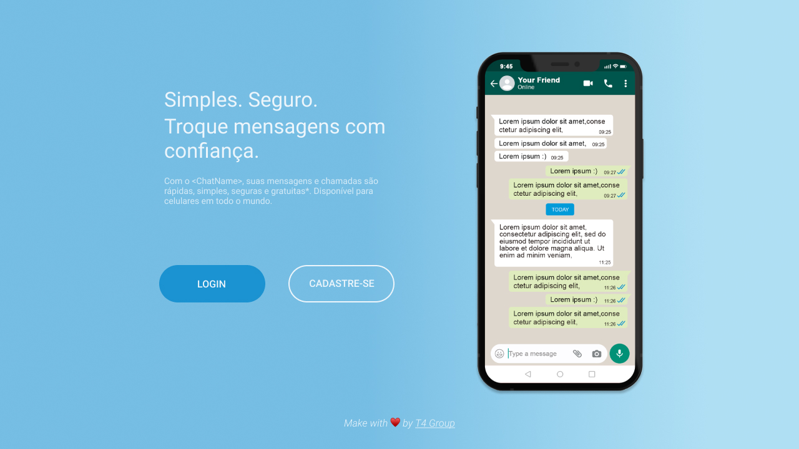
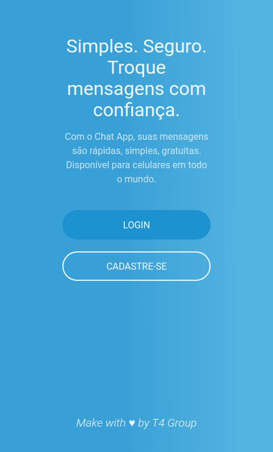

# Projeto

Chat com sistema de login.

## Sobre

Projeto de implementação de um chat para a diciplina Ambiente de desenvolvimento e Operação (DevOps)

Consiste em um chat simples com funcionalidades basicas.

Você pode ver um demostranção do projeto [em breve]().

## Recursos

- [ ] Cadastro
- [ ] Autenticação
- [ ] Chat
- [ ] Seleção de Interlocutor

## 🚀 Rodando o projeto

Essas instruções permitirão que você obtenha uma copia do projeto em sua maquina local com proposito de desenvolvimento ou testes.

## 📋 Pre-requisitos

Em breve 🔜

## 🔧 Instalação e Execução

Em breve 🔜

## 🛠️ Technologies

Em breve 🔜

## Autores

_Ruy Araujo_

_caiobas_

_CamillaTB_

_Leonzordx_

## 📷 Prints

## 📄 License

Em breve 🔜
